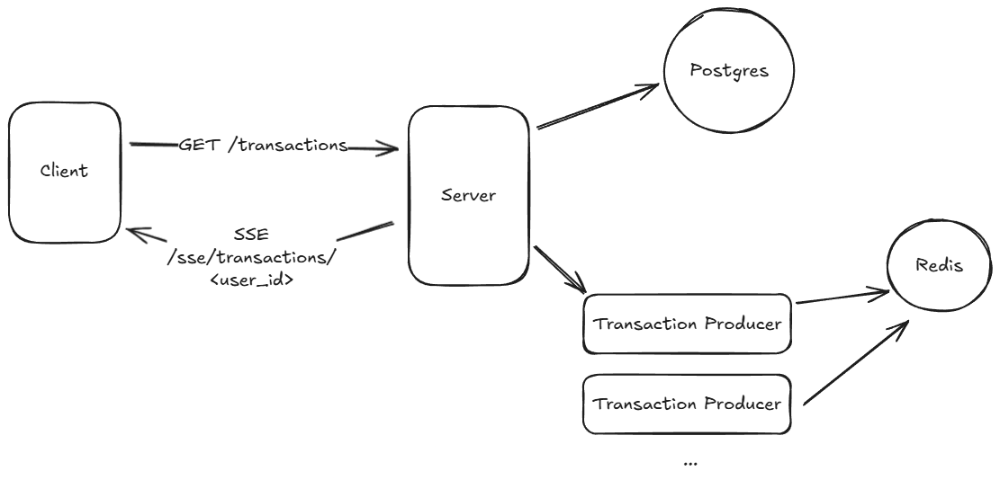

# anomaly-detection-server

Deployment link https://anomaly-detection-server-0-0-1.onrender.com/

Experiment with the API https://anomaly-detection-server-0-0-1.onrender.com/docs (swagger docs)

## Frontend

Github: https://github.com/kurayami07734/anomaly-detection-client

Deployment link: https://anomaly-detection-client.vercel.app/

### Table of contents

1. [System Design](#system-design)
2. [Query performance](#query-performance)
3. [Setup locally](#setup-locally)
4. [API calls](#api-calls)
5. [Testing](#testing)


## System design




### Components

1. **Client**: Simple web client, it makes GET requests and has a Server sent events connections
2. **Server**: Serves web requests, has connections to postgres database and redis
3. **Transaction producer**: This is created inside the FastAPI server, it is created when client make request for SSE events for a particular user.
     It also checks whether the transaction is anomalous. 


### Anomaly detection logic

1. Maintain the recent transactions for a user in redis
2. When new transaction is generated in the producer, this amount is compared to the rolling mean of the recent transactions.

#### Note

The transaction producer is also handling the anomaly detection logic. This is done to avoid having an extra detection service that runs persistently.
This is reduces the issues around having multiple servers having access to the database.

There will be as many transactions producers running as many users are connected for the SSE events.

## Scalability 

### Indexes added
1. id index => To enforce unique constraint on primary key
2. ix_user_date_amount_id => To improve query performance of primary data access pattern

### Partitioning

I have skipped partitioning here to keep the code simple.
But partitioning by transaction date, into monthly or weekly partitions will work nicely

### Caching 

Not added yet. One approach would be to create a hash from the all filters passed to the transactions API, and cache the result in redis.


Primary query looks like the following

```sql
EXPLAIN ANALYZE
SELECT
    transactions.amount,
    transactions.currency,
    transactions.txn_date,
    transactions.status,
    transactions.meta_data,
    transactions.id,
    transactions.user_id
FROM
    transactions
WHERE
    transactions.user_id = '4aed997e-ee19-4a56-9906-05dc8786e7fd'
    AND transactions.txn_date >= '2025-09-15T16:12:34.043621Z'
    AND transactions.txn_date <= '2025-10-15T16:12:34.043676Z'
    AND transactions.amount >= 1.00
    AND transactions.amount <= 100000.00
ORDER BY
    transactions.txn_date DESC,
    transactions.id ASC
LIMIT 100;
```

output of explain analyze

```bash
QUERY PLAN
--------------------------------------------------------------------------------------------------
Limit  (cost=3.61..325.85 rows=100 width=79) (actual time=0.182..0.271 rows=100 loops=1)
  ->  Incremental Sort  (cost=3.61..3757.67 rows=1165 width=79) 
                        (actual time=0.180..0.263 rows=100 loops=1)
        Sort Key: txn_date DESC, id
        Presorted Key: txn_date
        Full-sort Groups: 4  Sort Method: quicksort  Average Memory: 29kB  Peak Memory: 29kB
        ->  Index Scan Backward using ix_user_date_amount_id on transactions 
                                     (cost=0.42..3705.24 rows=1165 width=79) 
                                     (actual time=0.046..0.218 rows=101 loops=1)
              Index Cond: ((user_id = '4aed997e-ee19-4a56-9906-05dc8786e7fd'::uuid) 
                           AND (txn_date >= '2025-09-15 21:42:34.043621+05:30'::timestamp 
                                            with time zone) 
                           AND (txn_date <= '2025-10-15 21:42:34.043676+05:30'::timestamp 
                                            with time zone) 
                           AND (amount > ...))
Planning Time: 0.191 ms
Execution Time: 0.337 ms
```

## Setup locally

```bash
cp .env.example .env
```

```bash
docker compose --file docker-compose-local.yml up
```


### Load data

```bash
docker exec -it anomaly-detector-server sh
```

```bash
uv run python load_data.py
```


## API calls

curl commands to call the APIs

### Get transactions API

```bash
curl -X 'GET' \
  'https://anomaly-detection-server-0-0-1.onrender.com/transactions?user_id=35e1757d-a92a-4f07-a2ae-c13b81fd5581&from_date=2025-09-17T03%3A33%3A09.262961Z&to_date=2025-10-17T03%3A33%3A09.263008Z&min_amount=0.00&max_amount=10000000000.00&limit=100' \
  -H 'accept: application/json'
```

### User transaction SSE

```bash
curl -N https://anomaly-detection-server-0-0-1.onrender.com/sse/transactions/<user_id>
```

### Check health

```bash
curl https://anomaly-detection-server-0-0-1.onrender.com/health
```

## Testing

Run integration tests locally

```bash
# install dev dependencies
uv sync --dev
```

```bash
pytest
```